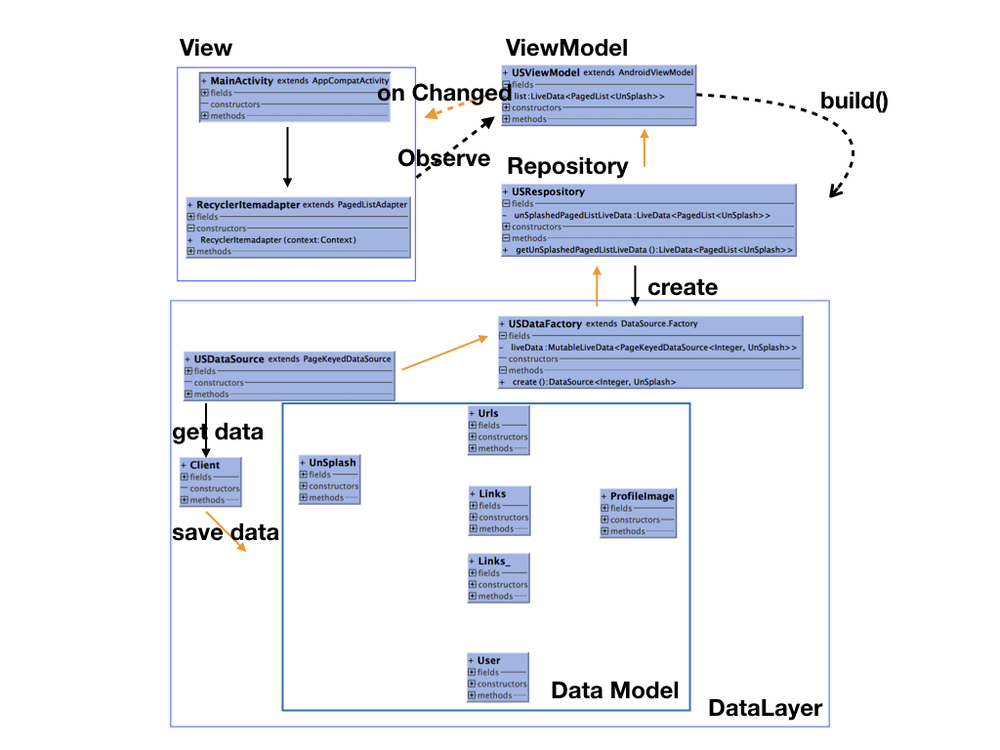

## UnSplashforAAC
분류: 개인 프로젝트 / 이미지 리스트 앱 (Java)
_ _ _

설명: AAC(Android Architecture Components)을 사용하여
이미지 리스트 화면 보여주기 (오픈 API 활용)
_ _ _

구현 방법 : Paging Library을 사용하여,MVVM패턴(AndroidViewModel) 구현
- 1단계 : Data Model 만들기
- 2단계 : Data를 가져올 클라이언트 만들기
- 3단계 : DataSource 만들기
- 4단계 : Repository / Factory 클래스 만들기
- 5단계 : ViewModel 만들기
- 6단계 : View 만들기
- 7단계 : PagedListAdapter 만들기

_ _ _

UML :

_ _ _

사용한 라이브러리 :
1. AAC - Lifecycle, Paging
2. ButterKnife - 뷰바인딩
3. GSON - JSON 파싱
4. Retrofit - Rest(Http)통신
5. Okhttp - Rest(Http)통신의 Interceptor처리
6. Glid - 리스트 이미지 처리

